# Factory Work Orders Timeline

## Screenshots

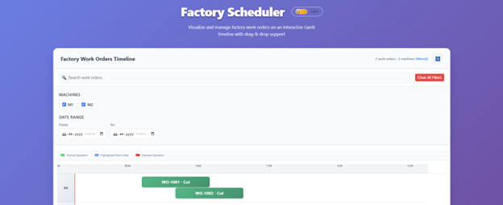
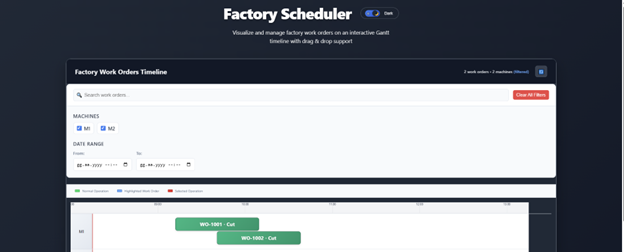
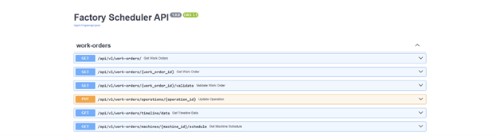
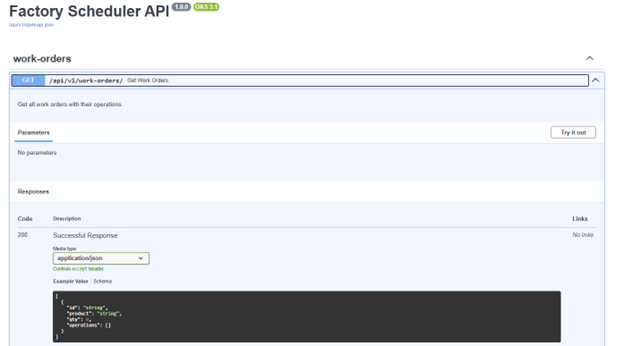
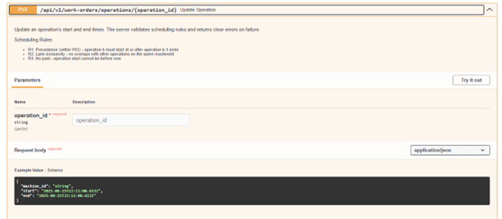
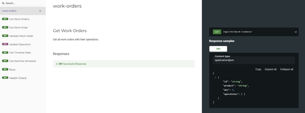
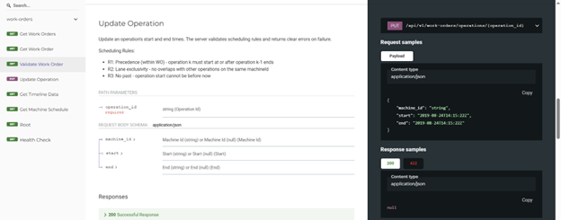

### Case Screens
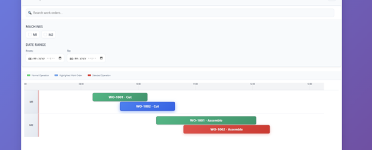
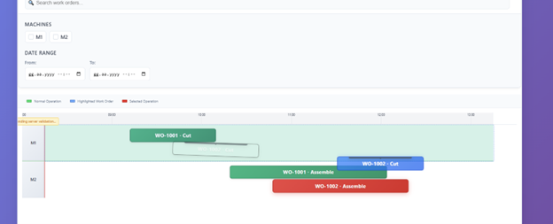
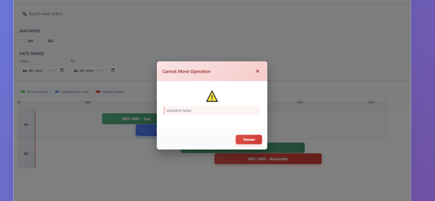

### Simulation
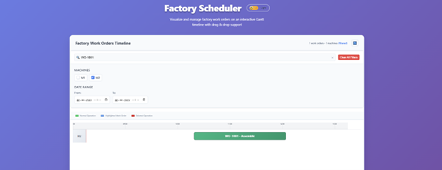
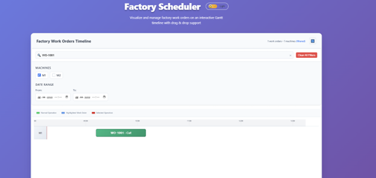


## Architecture

### Technology Stack

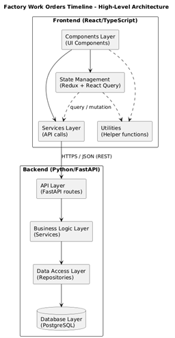

**Backend:**
- Python 3.11+ with FastAPI framework
- PostgreSQL 15 for data persistence
- SQLAlchemy 2.0 ORM with Alembic migrations
- Pydantic for data validation and serialization
- Async/await pattern 

**Frontend:**
- React 18 with TypeScript
- Redux Toolkit for state management
- React Query for server state
- Tailwind CSS for styling


### System Architecture


```
Backend (Python/FastAPI)
├── API Layer (FastAPI routes)
├── Business Logic Layer (Services)
├── Data Access Layer (Repositories)
└── Database Layer (PostgreSQL)

Frontend (React/TypeScript)
├── Components Layer (UI Components)
├── State Management (Redux + React Query)
├── Services Layer (API calls)
└── Utilities (Helper functions)
```

## Project Structure

```
factory-scheduler/
├── backend/                    # Python FastAPI backend
│   ├── app/
│   │   ├── api/               # API routes and endpoints
│   │   │   └── v1/
│   │   │       ├── api.py     # Main API router
│   │   │       └── endpoints/
│   │   │           └── work_orders.py  # Work order endpoints
│   │   ├── business/          # Business logic layer
│   │   │   └── scheduling_rules.py    # R1-R3 validation rules
│   │   ├── core/              # Core configuration
│   │   │   └── config.py      # App settings
│   │   ├── db/                # Database configuration
│   │   │   ├── base.py        # Base model class
│   │   │   └── session.py     # Database session management
│   │   ├── models/            # SQLAlchemy ORM models
│   │   │   └── work_order.py  # Work order and operation models
│   │   ├── repositories/      # Data access layer
│   │   │   ├── base.py        # Base repository pattern
│   │   │   └── work_order.py  # Work order repository
│   │   ├── schemas/           # Pydantic schemas
│   │   │   └── work_order.py  # Request/response models
│   │   ├── services/          # Business services
│   │   │   └── work_order_service.py  # Work order business logic
│   │   └── main.py           # FastAPI application entry point
│   ├── alembic/              # Database migrations
│   ├── scripts/              # Utility scripts
│   │   ├── run_migrations.py
│   │   └── seed_data.py      # Initial data seeding
│   ├── requirements.txt      # Python dependencies
│   └── Dockerfile
├── frontend/                   # React TypeScript frontend
│   ├── src/
│   │   ├── components/        # React components
│   │   │   ├── GanttTimeline.tsx      # Main timeline container
│   │   │   ├── MachineLane.tsx        # Individual machine lane
│   │   │   ├── OperationBar.tsx       # Operation visualization
│   │   │   ├── TimelineAxis.tsx       # Time axis component
│   │   │   ├── SearchFilter.tsx       # Filtering interface
│   │   │   └── ErrorModal.tsx         # Error handling modal
│   │   ├── hooks/            # Custom React hooks
│   │   │   ├── useWorkOrders.ts       # Work order data fetching
│   │   │   ├── useAppDispatch.ts      # Redux dispatch hook
│   │   │   └── useAppSelector.ts      # Redux selector hook
│   │   ├── services/         # API communication
│   │   │   ├── api.ts                 # HTTP client and endpoints
│   │   │   └── queryClient.ts         # React Query configuration
│   │   ├── store/            # Redux store
│   │   │   ├── index.ts               # Store configuration
│   │   │   └── slices/
│   │   │       └── timelineSlice.ts   # Timeline state management
│   │   ├── types/            # TypeScript type definitions
│   │   │   ├── index.ts               # Core types
│   │   │   └── dragDrop.ts            # Drag and drop types
│   │   ├── utils/            # Utility functions
│   │   │   ├── timeUtils.ts           # Time calculation helpers
│   │   │   ├── dragUtils.ts           # Drag and drop utilities
│   │   │   └── laneUtils.ts           # Lane layout calculations
│   │   └── App.tsx           # Main application component
│   ├── package.json          # Node.js dependencies
│   └── Dockerfile
└── docker-compose.yml         # Multi-container setup
```

## Database Design

### PostgreSQL Implementation

The application uses PostgreSQL as its primary database with the following key design decisions:

**Tables:**
- `work_orders`: Stores work order information (ID, product, quantity)
- `operations`: Stores individual operations with foreign key to work orders
- Relationships: One work order has many operations (1:N)

**Key Features:**
- ACID compliance for data integrity
- Indexed foreign keys for optimal query performance
- UTC timestamp storage for consistent time handling
- Constraint-based validation at database level

### SQLAlchemy ORM Integration

The application leverages SQLAlchemy 2.0 with modern async patterns:

```python

class WorkOrder(Base):
    __tablename__ = "work_orders"
    
    id = Column(String, primary_key=True)
    product = Column(String, nullable=False)
    qty = Column(Integer, nullable=False)
    
    # Relationship with operations
    operations = relationship("Operation", back_populates="work_order")

class Operation(Base):
    __tablename__ = "operations"
    
    id = Column(String, primary_key=True)
    work_order_id = Column(String, ForeignKey("work_orders.id"))
    machine_id = Column(String, nullable=False)
    index = Column(Integer, nullable=False)  # Operation sequence
    start = Column(DateTime(timezone=True), nullable=False)
    end = Column(DateTime(timezone=True), nullable=False)
```

### Migration Strategy

Database schema changes are managed through Alembic migrations:
- Version-controlled schema evolution
- Rollback capabilities for safe deployments
- Automated migration execution in Docker environment

## Backend Implementation

### FastAPI Framework

The backend is built using FastAPI, chosen for its high performance and automatic API documentation generation.

**Key Features:**
- Async request handling for better performance
- Automatic OpenAPI/Swagger documentation
- Built-in data validation using Pydantic
- Dependency injection system
- CORS middleware for frontend integration

### Business Rules Engine

The application implements three critical scheduling rules:

**R1 - Precedence Rule:**
Operations within a work order must follow sequential order. Operation N+1 cannot start before operation N ends.

**R2 - Machine Exclusivity:**
No two operations can overlap on the same machine at the same time.

**R3 - Temporal Constraints:**
Operations cannot be scheduled in the past relative to current time.

**Implementation:**
```python
def validate_operation_update(operation, new_start, new_end, all_operations):
    # R1: Check precedence within work order
    # R2: Check machine conflicts
    # R3: Check past scheduling
    # Return validation result with detailed errors
```


### Repository Pattern

Data access is abstracted through repository pattern:
- Separation of business logic from data access
- Consistent query interfaces
- Easy testing with mock repositories
- Support for complex queries with proper indexing

## Frontend Implementation

### React Component Architecture

The frontend follows a component-based architecture with clear responsibilities:

**Component Hierarchy:**
```
App
├── GanttTimeline (Main container)
│   ├── SearchFilter (Filtering interface)
│   ├── TimelineAxis (Time scale display)
│   └── MachineLane[] (One per machine)
│       └── OperationBar[] (Individual operations)
└── ErrorModal (Error handling)
```


### Drag and Drop Implementation

The drag-and-drop functionality uses React DnD:

**Process Flow:**
1. User drags operation bar
2. Visual feedback during drag (pending validation message)
3. On drop: Calculate new time and machine
4. Send update request to backend
5. Backend validates R1-R3 rules
6. Success: Update UI with new data
7. Failure: Revert visual changes + show error modal

**Key Features:**
- Visual drop zones with feedback
- Collision detection
- Smooth animations
- Error handling with rollback


## Installation and Setup

### Prerequisites

- Docker and Docker Compose (recommended)
- Node.js 18+ and Python 3.11+ (for local development)
- PostgreSQL 15+ (for local database)

### Quick Start with Docker 

```bash
# Clone repository
git clone <repository-url>
cd factory-scheduler

# Start all services
docker-compose up -d
** docker compose up --build -d **

# Access application
# Frontend: http://localhost:3000
# Backend API: http://localhost:8001
# API Documentation for swagger: http://localhost:8001/docs
```

### Local Development Setup

**Backend Setup:**
```bash
cd backend
python -m venv venv
source venv/bin/activate  # Linux/Mac
# or venv\Scripts\activate  # Windows

pip install -r requirements.txt

# Set up database
docker run -d --name postgres \
  -e POSTGRES_USER=postgres \
  -e POSTGRES_PASSWORD=postgres \
  -e POSTGRES_DB=factory_scheduler \
  -p 5432:5432 postgres:15-alpine

# Run migrations and seed data
python scripts/seed_data.py

# Start backend server
uvicorn app.main:app --host 0.0.0.0 --port 8000 --reload
```

**Frontend Setup:**
```bash
cd frontend
npm install
npm start
```

## API Documentation

The backend provides comprehensive API documentation through FastAPI's automatic OpenAPI generation. Access the interactive documentation at:

- Swagger UI: `http://localhost:8001/docs`
- ReDoc: `http://localhost:8001/redoc`

### Key API Operations

**Get Timeline Data:**
```http
GET /api/v1/work-orders/timeline/data
```
Returns formatted data optimized for timeline visualization.

**Update Operation:**
```http
PUT /api/v1/work-orders/operations/{operation_id}
Content-Type: application/json

{
  "start": "2025-08-20T09:30:00Z",
  "end": "2025-08-20T10:30:00Z",
  "machine_id": "M1"
}
```
